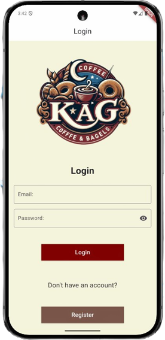
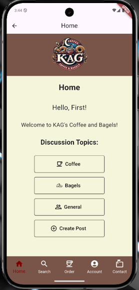
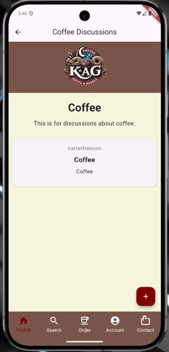
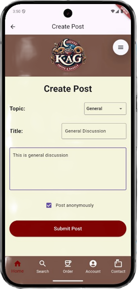
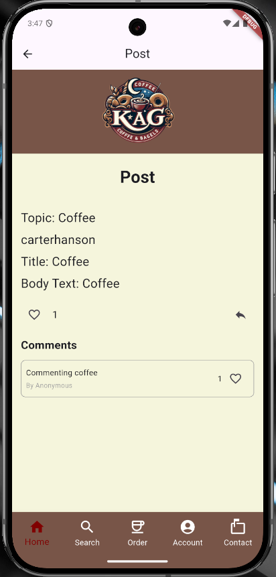
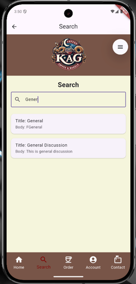
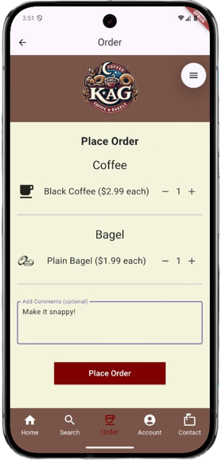
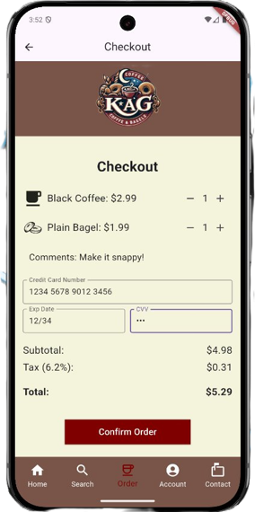
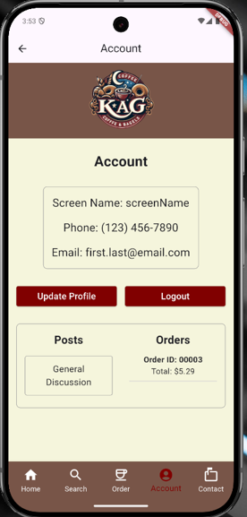
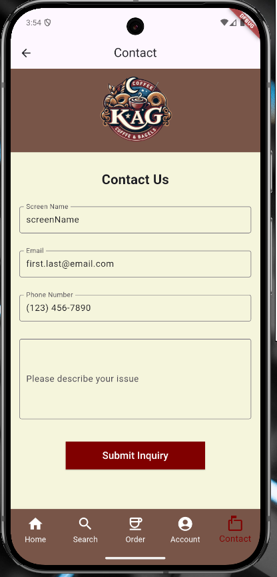

# KAG’s Coffee & Bagels

A three-person academic Flutter/Firebase prototype for a fictional café, developed for **SE330 Project 2** by **Carter Hanson, Landon Dahmen, and Brandon Reuss**. The project combines café ordering with community discussions; this repository represents the team's work.

## Features

- Email/password registration and sign-in through Firebase Authentication.
- Profiles with screen name, contact details, profile editing, and password changes through Firebase Authentication.
- Coffee, bagel, and general discussion posts, individual post views, replies/comments, likes, and post search.
- Coffee and bagel quantities, order comments, item pricing, a 6.2% tax calculation, and sequential order numbers.
- Simulated checkout, order confirmation, and account-level order history backed by Cloud Firestore.
- Contact inquiries saved to Cloud Firestore.

**Checkout is a simulation.** It does not collect card details or process real payments. New orders contain the user ID, quantities, prices/totals, comments, timestamp, and order number. Use dummy account and inquiry details, and do not include sensitive information in free-text comments. This is an academic prototype, not a production commerce application.

## Technology and platform scope

- Flutter and Dart for the interface and navigation.
- Firebase Authentication for email/password accounts.
- Cloud Firestore for profiles, posts, replies, orders, the order counter, and contact inquiries.
- Firebase App Check with the existing Android debug provider for development.

The project is **Android-focused**. Linux, web, and Windows scaffolding is present, but those targets have not been verified. There is no iOS project directory, and this repository does not establish verified iOS support.

## Run locally

1. Install Flutter with a Dart SDK satisfying `^3.7.0` and an Android development toolchain.
2. Clone and enter the repository:

   ```sh
   git clone https://github.com/landonwdahmen/KAGCoffee.git
   cd KAGCoffee
   ```

3. Review the existing Android Firebase client configuration in `android/app/google-services.json`. Running the connected app requires authorized access to a working Firebase project with Email/Password Authentication and Cloud Firestore enabled. The checked-in client configuration alone does not grant access.
4. The existing App Check debug provider requires development-device setup accepted by that Firebase project's App Check settings. Firestore queries may also require indexes. Rules, indexes, and Firebase console settings are not provisioned by this repository.
5. Install dependencies and launch on an Android emulator or device:

   ```sh
   flutter pub get
   flutter run
   ```

The cleanup retains the existing Firebase project identity and App Check provider. It does not configure a new backend or change deployed rules.

## Local checks

```sh
flutter analyze
flutter test
```

The six widget tests exercise login controls, empty-input validation, password visibility, navigation to registration, registration password-mismatch validation, and simulated checkout totals without initializing Firebase. They do not verify live authentication, Firestore permissions, or end-to-end ordering.

Local validation uses Flutter **3.29.3** and Dart **3.7.2**. Dependency resolution and the widget tests pass. Repository-wide analysis still reports existing warnings/lints (including filenames, unused code, and async UI context use). CI is deferred until those findings are resolved; this repository does not currently have a passing analyzer gate.

An Android debug build was attempted but stopped while Gradle was waiting on a dependency download. APK generation and on-device behavior have not been verified in this cleanup pass.

## Structure

```text
lib/main.dart          App startup and routes
lib/screens/           Authentication, profiles, discussions, ordering, and contact UI
assets/                Application images
screenshots/           Existing portfolio screenshots
test/                  Firebase-independent widget tests
android/               Android application and Firebase client configuration
linux/, web/, windows/ Additional platform scaffolding
```

## Known limitations

- App Check still uses `AndroidProvider.debug` unconditionally. Application ID `com.example.kagcoffee` and debug signing for release builds remain development settings.
- Profile email edits update Firestore separately from Firebase Authentication; account lookup still depends on the Auth email. Password changes may require recent sign-in.
- The first-like path for a newly created post and checkout submission/error handling need further functional hardening.
- Deployed Firestore access rules, indexes, and backend availability have not been audited or changed.
- Earlier versions could save passwords and card details in Firestore and print sensitive data. This source cleanup prevents those writes/logs going forward; it does not remove existing backend records or historical logs. Any historical data needs a separate authorized review.
- The existing screenshots document the earlier prototype. In particular, the checkout screenshot shows the former card-entry UI; the current checkout has no card inputs. Screenshots are retained as project history, not proof of the current UI or platform support.

## Screenshots

| Login/Register | Home | Forum/Discussion | Create Post |
|---|---|---|---|
|  |  |  |  |

| Individual Post | Search | Order | Checkout |
|---|---|---|---|
|  |  |  |  |

| Account | Contact |
|---|---|
|  |  |
