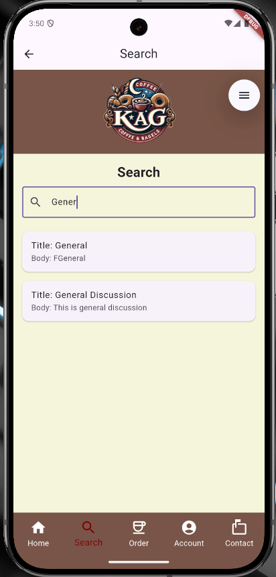

# KAGCoffee

**SE330 Project 2**  
**Contributors**: Carter Hanson, Landon Dahmen, Brandon Reuss

## About

**KAGCoffee** is a fully functional mobile application developed for a fictional business, **KAG’s Coffee & Bagels**, aimed at enhancing customer engagement through social features such as blogging. Designed for both phones and tablets, the app emphasizes user-friendly design and community interaction.

## Features

- **Blogging Platform:** Users can read and write blog posts, fostering a community around coffee culture.
- **User-Friendly Interface:** Intuitive design tailored for seamless navigation on mobile devices.
- **Cross-Platform Compatibility:** Built using Flutter, ensuring smooth performance on both Android and iOS.

## Technologies Used

- **Flutter** – For building natively compiled applications for mobile from a single codebase.
- **Dart** – Programming language optimized for building mobile, desktop, server, and web applications.
- **Firebase** *(if applicable)* – Backend services such as authentication, database, and hosting.

## Project Structure
KAGCoffee/
├── android/ # Android-specific files
├── assets/ # Images and other asset files
├── lib/ # Main application code
├── linux/ # Linux-specific files
├── test/ # Unit and widget tests
├── web/ # Web-specific files
├── windows/ # Windows-specific files
├── pubspec.yaml # Project metadata and dependencies
└── README.md # Project documentation

## Getting Started

To run this project locally:

1. **Clone the repository**:
    ```bash
    git clone https://github.com/landonwdahmen/KAGCoffee.git
    ```
2. **Navigate to the project directory**:
    ```bash
    cd KAGCoffee
    ```
3. **Install dependencies**:
    ```bash
    flutter pub get
    ```
4. **Run the application**:
    ```bash
    flutter run
    ```

*Make sure you have Flutter installed and set up. For more, visit the [Flutter install guide](https://flutter.dev/docs/get-started/install).*

## Screenshots

| Login/Register | Home | Forum/Discussion | Create Post |
|---|---|---|---|
|  |  |  |  |

| Individual Post | Search | Order | Checkout |
|---|---|---|---|
|  |  |  |  |

| Account | Contact |
|---|---|
|  |  |

## License

This project is licensed under the MIT License – see the [LICENSE](LICENSE) file for details.
